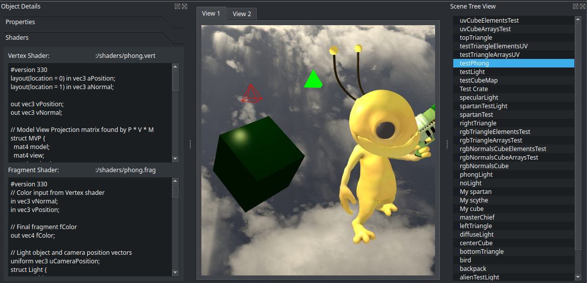
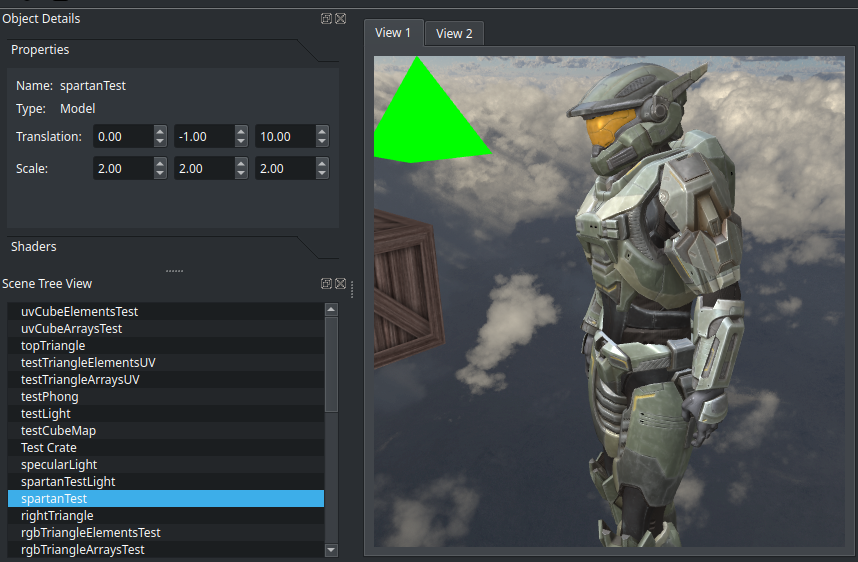
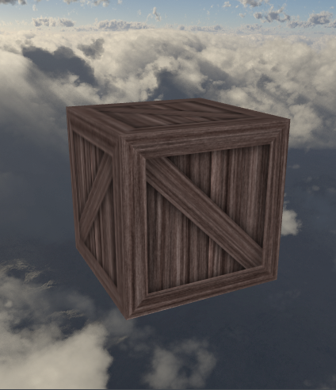
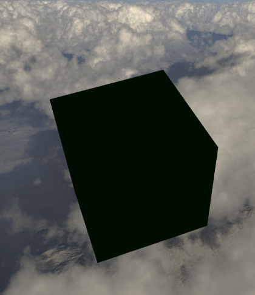
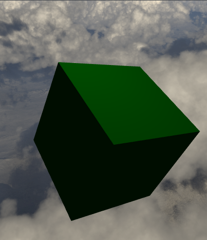
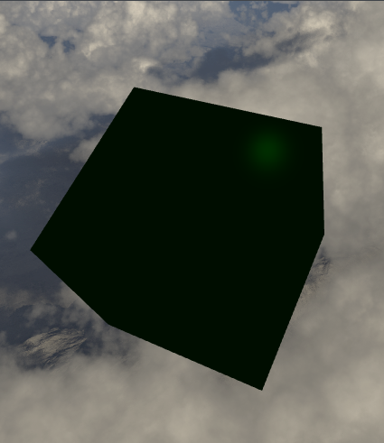
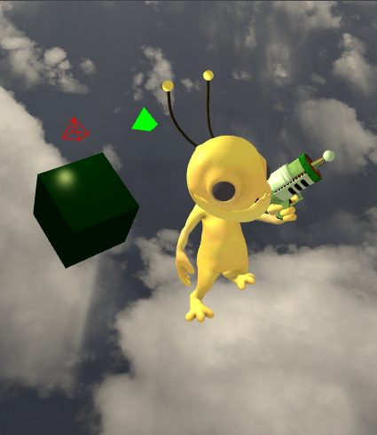
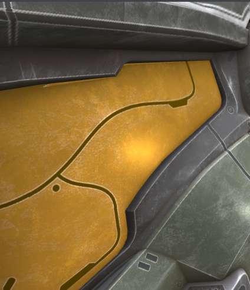
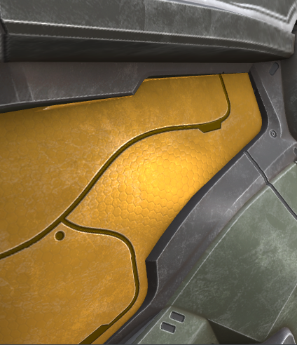

# Qtk

[](https://github.com/shaunrd0/qtk/actions/workflows/build.yml)
[](https://github.com/shaunrd0/qtk/actions/workflows/linting.yml)

The Qtk desktop application provides a model loader using [Assimp](https://assimp.org/) within a Qt widget application.
You can fly around the scene using WASD while holding down the left or right mouse button.
[QtkWidget](./src/designer-plugins/qtkwidget.h) is the primary QOpenGLWidget used to render the scene and handle input.

The underlying shared library [libqtk](./src/qtk) wraps QOpenGL objects in convenience classes that leverage
lower-level OpenGL APIs to handle the rendering process manually. Many of these classes offer
ways to expand the low-level OpenGL logic within a Qt application without having to set up much scaffolding.

The Qtk GUI is built using custom [Qt Designer plugins](https://doc.qt.io/qt-6/designer-creating-custom-widgets.html). These can be installed to Qt Designer for
use in other Qt applications, or built exclusively for Qtk. See [Build Options](#build-options) for more details.

Object names can be double-clicked in the tree view panel for quick camera navigation.
Properties of the object, like shader code and translation / scale, can be viewed and modified in the side panel.



All side panels and toolbars are dockable widgets that can be popped out
and reorganized as needed. Panels can also be stacked to create a docked widget with
tabs. The central widget that provides the camera view into the scene cannot be
detached from the main window in this way.



The small triangles floating near 3D models represent the light source being used for the shader.
These appear on models using phong, specular, and diffuse lighting techniques.

The example scene contains basic examples like texture mapping to make a crate from simple cube geometry.
This scene is used in the following screenshots, and can be built locally by enabling
the `QTK_GUI_SCENE` [Build Option](#build-options) described below. Because this scene
uses large 3D model resources, this option is disabled by default.

The default scene with this option disabled is empty, but comes with a default skybox.
Models can be added to the scene by clicking and dragging an `.obj` into the scene view.



Examples of Ambient, Diffuse, and Specular GLSL shaders.

| Ambient                                               | Diffuse                                               | Specular                                               |
|-------------------------------------------------------|-------------------------------------------------------|--------------------------------------------------------|
|  |  |  |

And more advanced techniques like Phong lighting (ambient + diffuse + specular) and normal mapping.



| Normal Mapping Disabled                              | Normal Mapping Enabled                                 |
|------------------------------------------------------|--------------------------------------------------------|
|  |  |

See the `View` toolbar menu to enable debug console widgets for open scenes or reopen previously closed panels.

Key features that are planned:

- [x] Runtime loading of `.obj` or similar 3D models.
- [x] Drag-and-drop interaction for adding objects to the scene.
- [x] Shader / object properties panel to modify related settings.
- [x] Reduce size of application resources and git references.
- [ ] Runtime reloading of modified GLSL shaders attached to objects within scenes.
- [ ] Multiple views of a scene at one time.
- [ ] Camera control modes such as panning, orbiting, or following objects.
- [ ] Save / load scene data. The current model requires writing C++ code.
- [ ] Basic text editor for quickly modifying shaders attached to objects.

For examples of using libqtk, see the [example-app](./example-app)
project in the root of this repository.

To get textures loading on models look
into [material files](http://www.paulbourke.net/dataformats/mtl/)
and see some examples at [qtk-resources/resources/models](https://git.shaunreed.com/shaunrd0/qtk-resources/src/branch/master/models).

### Source Builds

Qtk was developed and tested using CLion
and [Qt Creator](https://github.com/qt-creator/qt-creator).
Simply open the root `CMakeLists.txt` with either of these editors and default
configurations will be loaded. To simplify providing Qt to the build, Qt Creator
is the recommended option.

If you have manually installed [Qt6 Open Source Binaries](https://www.qt.io/download-qt-installer)
for your system, be sure to correctly set your `CMAKE_PREFIX_PATH` in the next steps.
On Ubuntu 24.04 the default installation directory to use for this path using Qt 6.5.0 is `$HOME/Qt/6.5.0/gcc_64/lib/cmake`.

The Ubuntu apt repositories contain all the packages we need to build all targets.
To build Qtk desktop application with the scene in the screenshots below run the following commands.

```bash
sudo apt update && sudo apt install cmake build-essential git ccache libxkbcommon-dev libassimp-dev qt6-base-dev qt6-tools-dev
cmake -DQTK_GUI_SCENE=ON -B build
cmake --build build
./build/bin/qtk_gui
```

#### Build Options

Qtk is composed of three separate components.

* The shared library [libqtk](./src/qtk) provides classes that leverage QOpenGL functionality
while still using lower-level OpenGL APIs to customize the rendering process.
Many of these classes can be further expanded, such as [Qtk::Scene](./src/qtk/scene.h).
This taget, `qtk` in cmake, is always selected to build and install as
it is required by all other components in this project.
* The [Qtk desktop application](./src/app) is built using libqtk within a Qt application.
This target, `qtk_gui` in cmake, is optional and can be controlled using the `QTK_GUI` option below.
* The GUI for the Qtk desktop application is constructed using a [custom set of Qt Designer widget plugins](./src/designer-plugins) that are also built using libqtk.
If `QTK_GUI` is disabled this target (`qtk_plugins`) is optional and can be controlled using the `QTK_PLUGINS` options below.


| Name                     | Description                                                  | Default |
|--------------------------|--------------------------------------------------------------|:--------|
| QTK_DEBUG                | Enable debug mode.                                           | OFF     |
| QTK_SUBMODULES           | Use git submodules to fetch assimp dependency.               | OFF     |
| QTK_EXAMPLE              | Build the libqtk example desktop application.                | ON      |
| QTK_CCACHE               | Enable CCACHE.                                               | ON      |
| QTK_ASSIMP_NEW_INTERFACE | Use the assimp::assimp interface. Recommended for WIN / OSX. | OFF     |
| QTK_PLUGINS*             | Install Qtk plugins to Qt Designer.                          | OFF     |
| QTK_GUI                  | Build and install Qtk desktop application.                   | ON      |
| QTK_GUI_SCENE            | Fetch external 3D model resources for example scene.         | OFF     |

*The Qtk plugins are always built if `QTK_GUI` is enabled. Disabling this option
with QTK_GUI set will not mark the plugins for installation if we do
`cmake --install build/` without selecting a component. If both `QTK_GUI` and
`QTK_PLUGINS` are unset, neither will be built.

If you are building on **Windows / Mac**, consider setting
the `-DQTK_ASSIMP_NEW_INTERFACE` cmake build option.

By default, the build will not initialize Assimp as a git submodule and build
from source.
We can turn this on by setting the `-DQTK_SUBMODULES=ON` flag when running
CMake.
Building using this option will fetch and build Assimp for us, but builds will
take longer as a result.
Using `-DQTK_SUBMODULES=ON` supports providing assimp on cross-platform builds (
Windows / Mac / Linux) and may be easier to configure.

```bash
cmake -B build-all -DQTK_GUI=ON -DQTK_PLUGINS=ON -DQTK_EXAMPLE=ON -DQTK_SUBMODULES=ON -DCMAKE_PREFIX_PATH=$HOME/Qt/6.6.0/gcc_64
```

#### Qtk Components

As described in [Build Options](#build-options), Qtk is composed of three separate components.
Each component can be individually selected for building or installation.

For this example we will configure the build with all options enabled.
In the separate sections below we can install individual components with cmake.

```bash
sudo apt update -y && sudo apt install cmake build-essential git ccache libxkbcommon-dev libassimp-dev qt6-base-dev qt6-tools-dev -y
git clone https://github.com/shaunrd0/qtk
cd qtk
# Configure the build with all components enabled
cmake -B build-all -DQTK_GUI=ON -DQTK_PLUGINS=ON -DQTK_EXAMPLE=ON -DCMAKE_PREFIX_PATH=$HOME/Qt/6.6.0/gcc_64
# Build all targets
cmake --build build-all/
````

Now that we have all the components fully built, the following sections will
install each component individually.
If you want to uninstall previously installed components, run the following command.

```bash
sudo xargs rm -v < install_manifest.txt
```

##### Qtk Library

Shared libqtk library for working with lower-level OpenGL to customize the rendering process.
We can install this library on a system path or a custom path and then
set `CMAKE_PREFIX_PATH` to point to this location when building an application
using libqtk.

Here we will install to the `/usr/local/` path.

```bash
# Install libqtk only
cmake --build build-all/ --target qtk -- -j $(nproc)
cmake --install build-all/ --component qtk --prefix=/usr/local
-- Install configuration: "Release"
-- Installing: /usr/local/lib/cmake/Qtk/QtkConfig.cmake
-- Installing: /usr/local/lib/cmake/Qtk/QtkConfigVersion.cmake
-- Installing: /usr/local/lib/cmake/Qtk/QtkTargets.cmake
-- Installing: /usr/local/lib/cmake/Qtk/QtkTargets-release.cmake
-- Installing: /usr/local/lib/static/libqtk.a
-- Installing: /usr/local/include/qtk/camera3d.h
-- Installing: /usr/local/include/qtk/input.h
-- Installing: /usr/local/include/qtk/meshrenderer.h
-- Installing: /usr/local/include/qtk/model.h
-- Installing: /usr/local/include/qtk/modelmesh.h
-- Installing: /usr/local/include/qtk/object.h
-- Installing: /usr/local/include/qtk/qtkapi.h
-- Installing: /usr/local/include/qtk/qtkiostream.h
-- Installing: /usr/local/include/qtk/qtkiosystem.h
-- Installing: /usr/local/include/qtk/scene.h
-- Installing: /usr/local/include/qtk/shape.h
-- Installing: /usr/local/include/qtk/skybox.h
-- Installing: /usr/local/include/qtk/texture.h
-- Installing: /usr/local/include/qtk/transform3D.h
```

##### Qtk GUI

The Qtk desktop application can be built and installed with the following commands.

```bash
cmake --build build-all/ --target qtk_gui -- -j $(nproc)
# Install Qtk desktop application (output removed)
# Installation prefix path must be absolute, since Qtk uses Qt deploy tools.
cmake --install build-all/ --component qtk_gui --prefix=$(pwd)/install
./install/bin/qtk_gui
```

If any errors are encountered loading plugins, we can debug plugin loading by
setting the following environment variable

```bash
QT_DEBUG_PLUGINS=1 ./install/bin/qtk_gui
```

##### Qtk Plugin Collection

This project defines a collection of widget plugins for use with Qt Designer.
These plugins were used to build the interface for the Qtk desktop application.
Qt Designer will list Qtk widgets in the side panel when editing a UI file
within the designer.
Qtk widgets will also render and behave correctly within the UI preview in
designer.
The widgets in the Qtk collection were created by implementing
the [QDesignerCustomWidgetInterface](https://doc.qt.io/qt-6/qdesignercustomwidgetinterface.html#details)
and [QDesignerCustomWidgetCollectionInterface](https://doc.qt.io/qt-6/qdesignercustomwidgetcollectioninterface.html)
interfaces.

To build and install the Qtk plugin collection -

```bash
cmake --build build-all/ --target qtk_plugins -- -j $(nproc)
# Install Qtk widget collection to use Qt Designer
# The path here should be initialized during build configuration, so no need for --prefix
cmake --install build-all/ --component qtk_plugins
-- Install configuration: "Release"
-- Up-to-date: /home/shaun/Qt/6.6.0/gcc_64/../../Tools/QtCreator/lib/Qt/lib/libqtk.a
-- Up-to-date: /home/shaun/Qt/6.6.0/gcc_64/../../Tools/QtCreator/lib/Qt/lib/libqtk_plugin_library.a
-- Up-to-date: /home/shaun/Qt/6.6.0/gcc_64/../../Tools/QtCreator/lib/Qt/plugins/designer/libqtk_collection.so
```

#### Example libqtk Application

There is a simple example of using libqtk in the [example-app/](example-app)
directory. The example can be built standalone using `find_package` or as a
target within any qtk build.

```bash
# Build the example from a configured qtk build tree
cmake --build build-all/ --target qtk_example -- -j $(nproc)
cmake --install build-all/ --component qtk_example --prefix=install
./install/bin/qtk_example
```

See the README in the [example-app/](example-app) subdirectory for instructions
on standalone builds.

#### Development

This project is using `clang-format` version `>=15.0.5`.
On Ubuntu 24.04, clang-format 18 is available to install in apt repositories.

```bash
sudo apt install clang-format clang-tidy
```

If `clang-format --version` is any earlier than `15.0.0`, running `clang-format` will fail because this project uses configuration options made available since `15.0.0`.

```bash
clang-format --version
Ubuntu clang-format version 18.1.3 (1ubuntu1)
```

CLion has integration for IDE code reformatting actions with `clang-format`.
If you're using CLion, the `.clang-format` configuration will be picked up by CLion automatically.

This repository provides the [`tools/format.sh`](./tools/format.sh) helper script to run `clang-tidy` and `clang-format` on Ubuntu 24.04.
Running the script will build Qtk, so it's important to ensure you can manually build from source first.

If you'd still like to run these tools manually, see the instructions below.

`clang-tidy` can be run with the following commands.

```bash
# Move to the root of the repo
cd qtk
# Build
cmake -B build && cmake --build build -- -j $(nproc)
```

```bash
export SOURCES=src/**/*.cpp src/**/*.h example-app/*.cpp example-app/*.h
run-clang-tidy -p build/ -j $(nproc --ignore=1) -fix -config-file=.clang-tidy $SOURCES
```

Last we need to run `clang-format`, this can be done with the command directly.
This will reformat all the code in the repository.

```bash
clang-format -i --style=file:.clang-format $SOURCES
```

`clang-format` can be run with git integration (or CLion if you prefer).
Git will only reformat the lines you modified, which can be useful.

```bash
# If we want to format the last N commits
# git clang-format HEAD~N
# 3 commits
git clang-format HEAD~3
changed files:
    app/examplescene.h
    app/mainwindow.h
    src/abstractscene.cpp
    src/skybox.h
    src/texture.cpp
    src/texture.h
    src/transform3D.h
```

##### Packaging

Packaging for Qtk is in early development.
This section documents how to package Qtk, but only source builds have been
verified on Windows / Mac / Linux.
For this reason, it is recommended to install Qtk by strictly building from
source at this time.

Below are the steps to package a Qtk release.

```bash
cd /path/to/qtk && cmake -B build
# Package Qtk
cmake --build build --target package
# Package Qtk including source files
cmake --build build --target package_source
```

Alternatively, we can use `cpack` directly -

```bash
cd /path/to/qtk && cmake -B build
# Generate all install packages
cpack -C Release
# Generate a specific archive package (ZIP)
cpack -C Release -G ZIP
# Generate a specific archive package (TGZ)
cpack -C Release -G TGZ
# Generate debian package (DEB)
cpack -C Release -G DEB
# Generate NSIS install package (NSIS)
cpack -C Release -G NSIS
```

Any of the above options can be appended with `--trace-expand` to debug package
generation issues.
The contents of all packages will depend on how the build was configured.

To generate packages for Qtk desktop application, we should
set `-DQTK_GUI=ON`. If this option is not set we will only package libqtk.

The NSIS installer will allow component-specific path modification for all of
these installation components through a Windows GUI install application.

##### Resources

Some useful links and resources that I have found while working on this project.

[Qt Designer UI file format](https://doc.qt.io/qt-6/designer-ui-file-format.html)

[QtPlugin Import / Export plugins](https://doc.qt.io/qt-6/qtplugin.html)

[KDAB](https://www.kdab.com/)

## Model Artists

"Alien Hominid" (https://skfb.ly/onStx) by Nwilly_art is licensed under Creative
Commons Attribution (http://creativecommons.org/licenses/by/4.0/).

"Scythe World Of Warcraft" (https://skfb.ly/6UooG) by Warcraft-3D-Models is
licensed under Creative Commons
Attribution (http://creativecommons.org/licenses/by/4.0/).

"Spartan Armour MKV - Halo Reach" (https://skfb.ly/6QVvM) by McCarthy3D is
licensed under Creative Commons
Attribution (http://creativecommons.org/licenses/by/4.0/).

"Survival Guitar Backpack (Low Poly)" (https://skfb.ly/6RnCB) by Berk Gedik is
licensed under Creative Commons
Attribution (http://creativecommons.org/licenses/by/4.0/).
Model by Berk Gedik,
from: https://sketchfab.com/3d-models/survival-guitar-backpack-low-poly-799f8c4511f84fab8c3f12887f7e6b36
Modified (learnopengl.com) material assignment (Joey de Vries) for easier load
in OpenGL model loading chapter, and renamed albedo to diffuse and metallic to
specular to match non-PBR lighting setup.

"Terror-bird (NHMW-Geo 2012/0007/0001)" (https://skfb.ly/onAWy) by Natural
History Museum Vienna is licensed under Creative Commons
Attribution-NonCommercial (http://creativecommons.org/licenses/by-nc/4.0/).

"Golden Lion Sitting OBJ Low Poly FREE" (https://skfb.ly/onZAH) by
LordSamueliSolo is licensed under Creative Commons
Attribution (http://creativecommons.org/licenses/by/4.0/).
