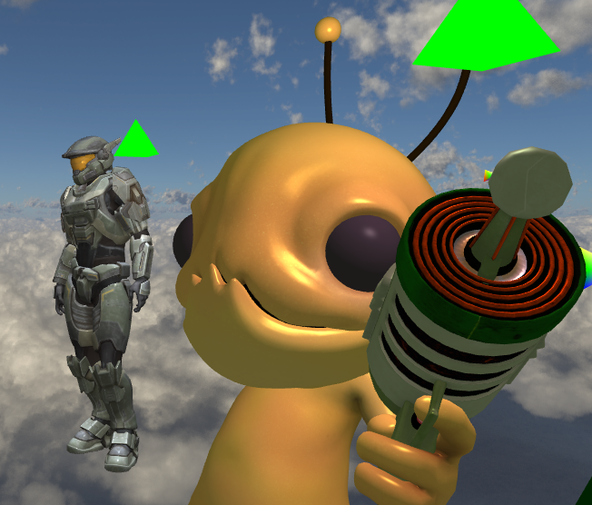
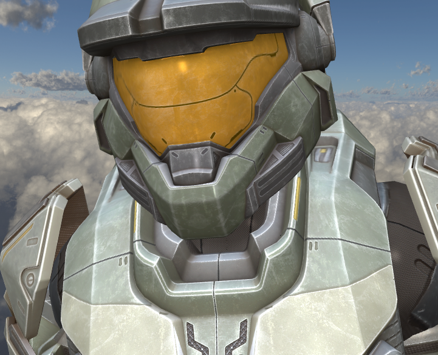
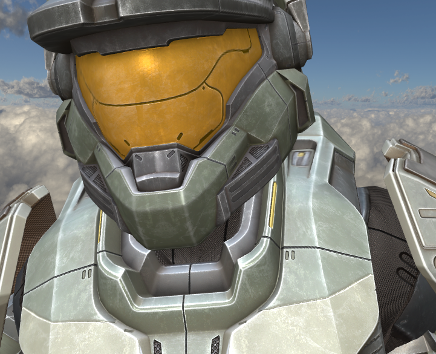

# Qtk

[](https://github.com/shaunrd0/qtk/actions/workflows/all-builds.yml)
[](https://github.com/shaunrd0/qtk/actions/workflows/linting.yml)

Qtk is a Qt OpenGL graphics library created primarily for my own learning
purposes. The library wraps some QOpenGL functionality in convenience classes
that allow rendering geometry in 2D and 3D using custom GLSL shader programs.

The long-term goal for this project is to create a tool that I can use to
practice shader coding or graphics programming techniques. In doing this I hope
to also learn more about the Qt UI framework, and the CMake build system.

Key features that are planned:

* Runtime loading of `.obj` or similar 3D models.
* Drag-and-drop interaction for adding objects to the scene.
* Runtime reloading of modified GLSL shaders attached to objects within scenes.
* Multiple views of a scene at one time.
* Camera control modes such as panning, orbiting, or following objects.
* Save / load for scene data. The current inheritance model is temporary.
* Basic text editor for quickly modifying shaders attached to objects.
* Shader / object properties panel to modify related settings.
* Reduce size of application resources and git references.

The Qtk desktop application provides a model loader
using [Assimp](https://assimp.org/) within a Qt widget application.

For examples of using the Qtk API, see the `example-app` project in the root of
this repository.

To get textures loading on models look
into [material files](http://www.paulbourke.net/dataformats/mtl/)
and see some examples in the `resources/models/` directory.

### Source Builds

Qtk was developed and tested using CLion
and [Qt Creator](https://github.com/qt-creator/qt-creator).
Simply open the root `CMakeLists.txt` with either of these editors and
configurations will be loaded.

This project has been ported to **Qt 6.5.0**, which is not yet available in
Ubuntu apt repositories.
To run this project, you will *need* to
install [Qt6 Open Source Binaries](https://www.qt.io/download-qt-installer) for
your system, **version 6.5.0** or later.
Be sure to take note of the Qt6 installation directory, as we will need it to
correctly set our `CMAKE_PREFIX_PATH` in the next steps.

If the build is configured with all options enabled, we can subsequently install
individual components as needed with cmake.

```bash
cmake -B build-all/ -DQTK_BUILD_GUI=ON -DQTK_INSTALL_LIBRARY=ON -DQTK_INSTALL_PLUGINS=ON
```

```bash
# Install libqtk only
cmake --install build-all/ --prefix=$(pwd)/install --component libqtk
-- Install configuration: "Release"
-- Up-to-date: /home/shaun/Code/qtk/install/lib/cmake/Qtk/QtkConfig.cmake
-- Up-to-date: /home/shaun/Code/qtk/install/lib/cmake/Qtk/QtkConfigVersion.cmake
-- Up-to-date: /home/shaun/Code/qtk/install/lib/cmake/Qtk/QtkTargets.cmake
-- Up-to-date: /home/shaun/Code/qtk/install/lib/cmake/Qtk/QtkTargets-release.cmake
-- Up-to-date: /home/shaun/Code/qtk/install/lib/static/libqtk_library.a
-- Up-to-date: /home/shaun/Code/qtk/install/include/qtk/camera3d.h
-- Up-to-date: /home/shaun/Code/qtk/install/include/qtk/input.h
-- Up-to-date: /home/shaun/Code/qtk/install/include/qtk/meshrenderer.h
-- Up-to-date: /home/shaun/Code/qtk/install/include/qtk/model.h
-- Up-to-date: /home/shaun/Code/qtk/install/include/qtk/modelmesh.h
-- Up-to-date: /home/shaun/Code/qtk/install/include/qtk/object.h
-- Up-to-date: /home/shaun/Code/qtk/install/include/qtk/qtkapi.h
-- Up-to-date: /home/shaun/Code/qtk/install/include/qtk/qtkiostream.h
-- Up-to-date: /home/shaun/Code/qtk/install/include/qtk/qtkiosystem.h
-- Up-to-date: /home/shaun/Code/qtk/install/include/qtk/scene.h
-- Up-to-date: /home/shaun/Code/qtk/install/include/qtk/shape.h
-- Up-to-date: /home/shaun/Code/qtk/install/include/qtk/skybox.h
-- Up-to-date: /home/shaun/Code/qtk/install/include/qtk/texture.h
-- Up-to-date: /home/shaun/Code/qtk/install/include/qtk/transform3D.h

# Install Qtk widget collection to use Qt Designer
cmake --install build-all/ --prefix=$(pwd)/install --component collection
-- Install configuration: "Release"
-- Up-to-date: /home/shaun/Qt/6.5.0/gcc_64/../../Tools/QtCreator/lib/Qt/lib/libqtk_library.a
-- Up-to-date: /home/shaun/Qt/6.5.0/gcc_64/../../Tools/QtCreator/lib/Qt/lib/libqtk_plugin_library.a
-- Up-to-date: /home/shaun/Qt/6.5.0/gcc_64/../../Tools/QtCreator/lib/Qt/plugins/designer/libqtk_collection.so

# Install Qtk desktop application (output removed)
cmake --install build-all/ --prefix=$(pwd)/install --component qtk
```

#### Qtk GUI

Once Qt6 is installed, to build and run `qtk` on Ubuntu -

```bash
sudo apt update -y && sudo apt install libassimp-dev cmake build-essential git ccache -y
git clone https://github.com/shaunrd0/qtk
cmake -S qtk/ -B qtk/build/ -DCMAKE_PREFIX_PATH=$HOME/Qt/6.5.0/gcc_64
cmake --build qtk/build/ -j $(nproc --ignore=2)
./qtk/build/bin/qtk-main
```

By default, the build will not initialize Assimp as a git submodule and build
from source.
We can turn this on by setting the `-DQTK_UPDATE_SUBMODULES=ON` flag when
running CMake.
Building using this option will fetch and build Assimp for us, but builds will
take longer as a result.
Using `-DQTK_UPDATE_SUBMODULES=ON` supports providing assimp on cross-platform
builds (Windows / Mac / Linux) and may be easier to configure.

```bash
cmake -S qtk/ -B qtk/build/ -DQTK_UPDATE_SUBMODULES=ON -DCMAKE_PREFIX_PATH=$HOME/Qt/6.5.0/gcc_64
cmake --build qtk/build/ -j $(nproc --ignore=2)
./qtk/build/bin/qtk-main
```

If any errors are encountered loading plugins, we can debug plugin loading by
setting the following environment variable -

```bash
QT_DEBUG_PLUGINS=1 ./qtk-main
```

#### Qtk Library

Qtk provides a simple library for working with QOpenGL.
We can install this library on a system path or a custom path and then
set `CMAKE_PREFIX_PATH` to point to this location when building an application
using libqtk.

Below is an example of installing on a system path.

```bash
cmake -S qtk/ -B qtk/build/ -DCMAKE_PREFIX_PATH=$HOME/Qt/6.5.0/gcc_64 -DQTK_BUILD_GUI=OFF -DQTK_INSTALL_PLUGINS=OFF -DQTK_DEBUG=OFF
cmake --build qtk/build/ -j $(nproc --ignore=2)
sudo cmake --install . --prefix=/usr/local
-- Install configuration: "Release"
-- Installing: /usr/local/lib/cmake/Qtk/QtkConfig.cmake
-- Installing: /usr/local/lib/cmake/Qtk/QtkConfigVersion.cmake
-- Installing: /usr/local/lib/cmake/Qtk/QtkTargets.cmake
-- Installing: /usr/local/lib/cmake/Qtk/QtkTargets-release.cmake
-- Installing: /usr/local/lib/static/libqtk_library.a
-- Installing: /usr/local/include/qtk/camera3d.h
-- Installing: /usr/local/include/qtk/input.h
-- Installing: /usr/local/include/qtk/meshrenderer.h
-- Installing: /usr/local/include/qtk/model.h
-- Installing: /usr/local/include/qtk/modelmesh.h
-- Installing: /usr/local/include/qtk/object.h
-- Installing: /usr/local/include/qtk/qtkapi.h
-- Installing: /usr/local/include/qtk/qtkiostream.h
-- Installing: /usr/local/include/qtk/qtkiosystem.h
-- Installing: /usr/local/include/qtk/scene.h
-- Installing: /usr/local/include/qtk/shape.h
-- Installing: /usr/local/include/qtk/skybox.h
-- Installing: /usr/local/include/qtk/texture.h
-- Installing: /usr/local/include/qtk/transform3D.h
```

#### Qtk Plugin Collection

This project defines a collection of widget plugins for use with Qt Designer.
These plugins were used to build the interface for the Qtk desktop application.
Qt Designer will list Qtk widgets in the side panel when editing a UI file
within the designer.
Qtk widgets will also render and behave correctly within the UI preview in
designer.
The widgets in the Qtk collection were created by implementing
the [QDesignerCustomWidgetInterface](https://doc.qt.io/qt-6/qdesignercustomwidgetinterface.html#details)
and [QDesignerCustomWidgetCollectionInterface](https://doc.qt.io/qt-6/qdesignercustomwidgetcollectioninterface.html)
interfaces.

To build and install the Qtk plugin collection -

```bash
cmake -S /path/to/qtk -B /path/to/qtk/build -DCMAKE_PREFIX_PATH=$HOME/Qt/6.5.0/gcc_64 -DQTK_INSTALL_PLUGINS=ON -DQTK_BUILD_GUI=OFF -DQTK_INSTALL_LIBRARY=OFF
cmake --build /path/to/qtk/build
cmake --install /path/to/qtk/build
```

To uninstall after a previous installation, we can run the following command
from the root of the repository.

```bash
xargs rm < build/install_manifest.txt
```

#### Windows / MacOS

If you are building on **Windows / Mac**, consider setting
the `-DASSIMP_NEW_INTERFACE` build flag.

```bash
cmake -S qtk/ -B qtk/build/  -DASSIMP_NEW_INTERFACE=ON -DCMAKE_PREFIX_PATH=$HOME/Qt/6.5.0/gcc_64;/path/to/assimp/
cmake --build qtk/build/ -j $(nproc --ignore=2)
```

### Controls

You can fly around the scene if you hold the right mouse button and use WASD.
If you see a small triangle floating by a model it represents the light source
that is being used for the shader rendering the model. These appear on models
using phong, specular, and diffuse lighting techniques.

Object names can be double-clicked in the tree view panel for quick camera
navigation. All panels and toolbars are dockable widgets that can be popped out
and reorganized as needed. Panels can be stacked to create a docked widget with
tabs. The central widget that provides the camera view into the scene cannot be
detached from the main window in this way. See the `View` menu to enable debug
console widgets for open scenes or reopen previously closed panels.



Spartan with no normals -



Spartan with normals -



#### Development

This project uses version `15.0.5` of `clang-format`.
Before merging any branch we should run `clang-tidy` followed by `clang-format`.

```bash
git clone git@github.com:llvm/llvm-project.git -b llvmorg-15.0.5
cd llvm-project
cmake -B build -DLLVM_ENABLE_PROJECTS=clang -DLLVM_ENABLE_RUNTIMES="libcxx;libcxxabi" -DCMAKE_BUILD_TYPE=Release -G "Unix Makefiles" llvm
cmake --build build -j $(nproc --ignore=2)
sudo cmake --build build -j $(nproc --ignore=2) --target install
```

If the `clang-format` version is any earlier than `15.0.0`,
running `clang-format` will fail because this project uses configuration options
made available since `15.0.0`.

```bash
clang-format --version
clang-format version 15.0.5 (git@github.com:llvm/llvm-project.git 154e88af7ec97d9b9f389e55d45bf07108a9a097)
```

CLion has integration for IDE code reformatting actions with `clang-format`.
If you're using CLion, the `.clang-format` configuration will be picked up by
CLion automatically.

`clang-tidy` can be run with the following commands.

```bash
# Move to the root of the repo
cd qtk
# Build
cmake -B build && cmake --build build
clang-tidy -p build/ --fix --config-file=.clang-tidy src/*.cpp src/*.h app/*.cpp app/*.h
```

Last we need to run `clang-format`, this can be done with the command directly.
This will reformat all the code in the repository.

```bash
clang-format -i --style=file:.clang-format src/*.cpp src/*.h app/*.cpp app/*.h
```

`clang-format` can be run with git integration (or CLion if you prefer).
Git will only reformat the lines you modified, which can be useful.

```bash
# If we want to format the last N commits
# git clang-format HEAD~N
# 3 commits
git clang-format HEAD~3
changed files:
    app/examplescene.h
    app/mainwindow.h
    src/abstractscene.cpp
    src/skybox.h
    src/texture.cpp
    src/texture.h
    src/transform3D.h
```

##### Packaging

Packaging for Qtk is in early development.
This section documents how to package Qtk, but only source builds have been
verified on Windows / Mac / Linux.
For this reason, it is recommended to install Qtk by strictly building from
source at this time.

Below are the steps to package a Qtk release.

```bash
cd /path/to/qtk && cmake -B build
# Package Qtk
cmake --build build --target package
# Package Qtk including source files
cmake --build build --target package_source
```

Alternatively, we can use `cpack` directly -

```bash
cd /path/to/qtk && cmake -B build
# Generate all install packages
cpack -C Release
# Generate a specific archive package (ZIP)
cpack -C Release -G ZIP
# Generate a specific archive package (TGZ)
cpack -C Release -G TGZ
# Generate debian package (DEB)
cpack -C Release -G DEB
# Generate NSIS install package (NSIS)
cpack -C Release -G NSIS
```

Any of the above options can be appended with `--trace-expand` to debug package
generation issues.
The contents of all packages will depend on how the build was configured.

If we are generating packages for *only* libqtk, we
set `-DQTK_INSTALL_LIBRARY=ON`
during the cmake configuration step.
To generate packages for Qtk desktop application, we should
set `-DQTK_BUILD_GUI=ON`, and optionally `-DQTK_INSTALL_LIBRARY=ON` if we would
like to bundle libqtk with the desktop application.

The NSIS installer will allow component-specific path modification for all of
these installation components through a GUI install application.

##### Resources

Some useful links and resources that I have found while working on this project.

[Qt Designer UI file format](https://doc.qt.io/qt-6/designer-ui-file-format.html)

[QtPlugin Import / Export plugins](https://doc.qt.io/qt-6/qtplugin.html)

[KDAB](https://www.kdab.com/)

## Model Artists

"Alien Hominid" (https://skfb.ly/onStx) by Nwilly_art is licensed under Creative
Commons Attribution (http://creativecommons.org/licenses/by/4.0/).

"Scythe World Of Warcraft" (https://skfb.ly/6UooG) by Warcraft-3D-Models is
licensed under Creative Commons
Attribution (http://creativecommons.org/licenses/by/4.0/).

"Spartan Armour MKV - Halo Reach" (https://skfb.ly/6QVvM) by McCarthy3D is
licensed under Creative Commons
Attribution (http://creativecommons.org/licenses/by/4.0/).

"Survival Guitar Backpack (Low Poly)" (https://skfb.ly/6RnCB) by Berk Gedik is
licensed under Creative Commons
Attribution (http://creativecommons.org/licenses/by/4.0/).
Model by Berk Gedik,
from: https://sketchfab.com/3d-models/survival-guitar-backpack-low-poly-799f8c4511f84fab8c3f12887f7e6b36
Modified (learnopengl.com) material assignment (Joey de Vries) for easier load
in OpenGL model loading chapter, and renamed albedo to diffuse and metallic to
specular to match non-PBR lighting setup.

"Terror-bird (NHMW-Geo 2012/0007/0001)" (https://skfb.ly/onAWy) by Natural
History Museum Vienna is licensed under Creative Commons
Attribution-NonCommercial (http://creativecommons.org/licenses/by-nc/4.0/).

"Golden Lion Sitting OBJ Low Poly FREE" (https://skfb.ly/onZAH) by
LordSamueliSolo is licensed under Creative Commons
Attribution (http://creativecommons.org/licenses/by/4.0/).
